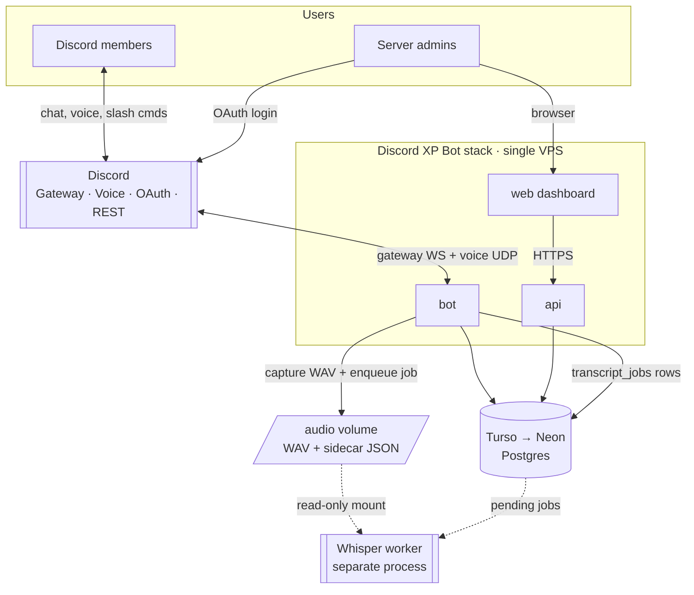
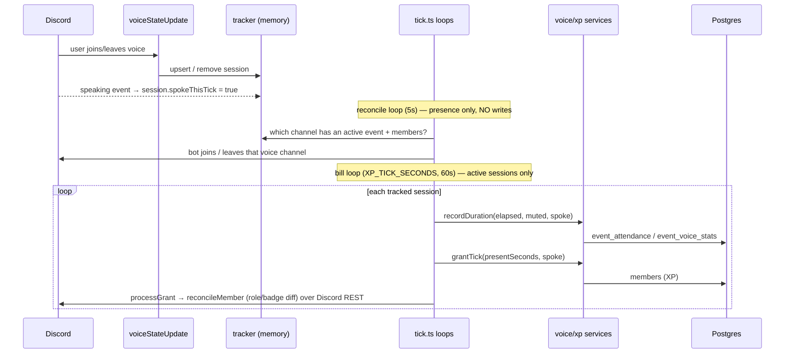
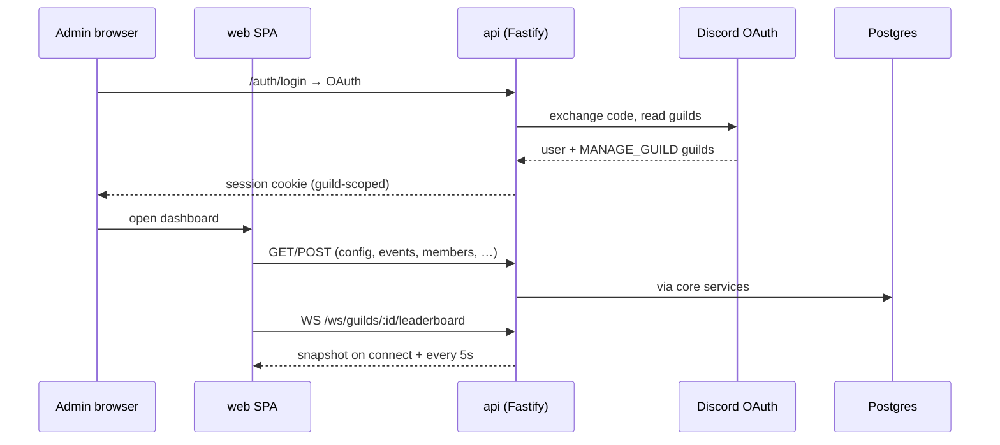
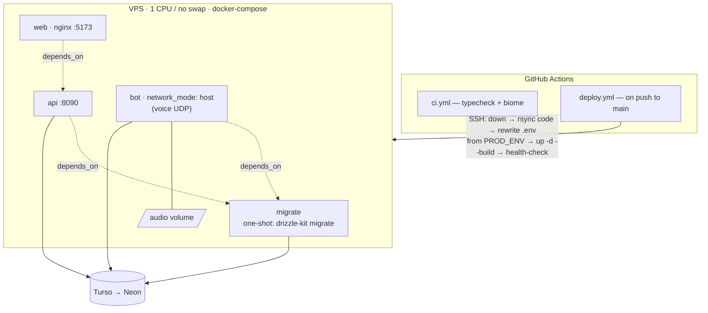

# System Architecture — Discord XP Bot

**Scope:** the whole stack — bot, API, dashboard, shared core, and how they run in production.
**DB note:** this documents the current system. The database is mid-migration from Turso (sqlite/
libsql, sync) to Neon Postgres (async) — see [postgres-migration-plan.md](./postgres-migration-plan.md).
Diagrams below mark the DB as "Turso → Neon" where it matters.

---

## 1. What it is

A Discord community engagement bot with a web dashboard. It awards XP for chatting and for time
spent (and spoken) in voice during events, tracks per-event attendance, syncs level-reward roles,
runs scheduled announcements, a private-thread ticket system, and optionally captures voice audio for
a separate transcription worker.

Monorepo (pnpm workspace), 5 packages. All business logic + DB access lives in **`@xp/core`**; the
bot / api / web are thin deployables on top of it.

| Package | Role | Stack |
|---|---|---|
| **`@xp/core`** | Shared domain: DB schema + client, all DAOs/services, env validation, utils. Single source of business logic. | drizzle-orm, zod, libsql/`@libsql/client`/better-sqlite3 (→ `pg` after migration) |
| **`@xp/bot`** | The Discord bot — gateway + voice, event handlers, slash commands, XP/attendance engine, audio capture. | discord.js, @discordjs/voice |
| **`@xp/api`** | HTTP + WebSocket backend for the dashboard. Discord OAuth, sessions, CRUD over core services. | Fastify |
| **`@xp/web`** | The dashboard SPA (tabs: leaderboard, attendance, events, config, badges, tickets, …). | React, Vite |
| **`@xp/landing`** | Static marketing/landing site (independent of the app). | Astro |

---

## 2. System context



External dependencies: **Discord** (gateway, voice, OAuth2, REST), **Postgres** (Turso→Neon), and an
**out-of-repo Whisper worker** that consumes `transcript_jobs` + the audio volume. The bot must be a
**single always-on process** — it holds a persistent gateway WebSocket and real-time voice UDP, so it
can never be serverless or queue-started.

---

## 3. Components

```mermaid
flowchart LR
  subgraph bot [@xp/bot]
    EV["events/<br/>messageCreate · voiceStateUpdate · interactionCreate"]
    VOICE["voice/<br/>tracker (mem) · tick (reconcile+bill) · capture"]
    FEAT["features/<br/>announce · scheduled-tick · tickets"]
    CMD["commands + deploy-commands<br/>(registered on every boot)"]
  end

  subgraph api [@xp/api · Fastify]
    CTRL["controllers/ + routes/<br/>admins · events · config · leaderboard · members · badges · tickets · …"]
    AUTH["middleware/auth<br/>Discord OAuth · session · MANAGE_GUILD"]
    WS["ws.routes<br/>leaderboard snapshot / 5s"]
  end

  subgraph web [@xp/web · React]
    TABS["10 feature tabs<br/>Config · Channels · Events · Attendance · LevelRewards ·<br/>Badges · Leaderboard · Announcements · Tickets · Admins<br/>(+ VoiceCapture card, not a tab)"]
  end

  subgraph core [@xp/core]
    SVC["domains/*.service — business logic"]
    DAO["domains/*.dao — drizzle queries"]
    SCHEMA["db/schema · db/client"]
    ENV[env · util]
  end

  DB[(Postgres)]

  EV --> SVC
  VOICE --> SVC
  FEAT --> SVC
  CTRL --> SVC
  WS --> SVC
  AUTH --> SVC
  TABS -->|fetch| CTRL
  SVC --> DAO --> SCHEMA --> DB
```

`@xp/core` domains: `announcements`, `auth`, `badges`, `leveling`, `rewards`, `rules`, `ticketing`,
`transcript`, `voice`, `xp`. The bot, api, and web never touch drizzle directly — they call services.
`web` imports from core for **types only** (no server-side DB).

---

## 4. Key runtime flows

### 4.1 Voice XP + attendance (the core engine)



Two loops, two jobs: **reconcile** decides *where the bot sits in voice* (reads config/events, no
DB writes); **bill** credits *attendance + XP* (writes, only while people are in voice). Speaking is
debounced to an in-memory boolean — the audio stream never hits the DB.

**Level-role / badge sync transport:** both chat and voice grants funnel through
[`processGrant`](../packages/bot/src/lib/rewards.ts), which calls core's `reconcileMember` to compute
the role/badge diff and **applies it over the Discord REST API** (pure-diff-per-transport, per
[ADR 0001](./adr/0001-level-role-sync-pure-diff-applied-per-transport.md)). This REST side-effect —
not a DB write — is how "syncs level-reward roles" actually reaches Discord, and it's best-effort
(logs, never throws).

### 4.2 Message XP
`messageCreate` → `xpService.grantMessage` → `members` (XP), applying channel rules + event multipliers.

### 4.2b Slash commands
On every boot (`ClientReady`), `deployCommands()` registers the command set with Discord — **guild-scoped**
if `DISCORD_GUILD_ID` is set (instant) or **global** otherwise. At runtime `interactionCreate` dispatches
each command (its handler is already `try/catch`-guarded).

### 4.3 Dashboard (read + write)



Auth: Discord OAuth2, cookie session (`SESSION_SECRET`). Authorization per guild is granted by the
`MANAGE_GUILD` permission bit **or** an explicit `admins` allowlist row (`authService.canManage`). Two
**dev-only** bypasses exist: `AUTH_DISABLED=true` (short-circuits all checks + returns a synthetic
all-guilds session) and a `/auth/dev-login` route auto-registered when `DISCORD_CLIENT_SECRET` is
unset. Neither should ever be enabled in production.

### 4.4 Transcript capture (optional, `TRANSCRIPTS_ENABLED`)
While the bot is in voice, `capture.ts` records each speaker's Opus stream, decodes to WAV
(s16le 48 kHz stereo), ends the utterance on a ~1 s silence boundary, writes the file to the `audio`
volume, and enqueues a `transcript_jobs` row. A **separate Whisper worker** (not in this repo) consumes
pending jobs + the mounted audio. No effect on XP.

### 4.5 Scheduled announcements & tickets
- **Announcements:** rows in `scheduled_announcements`; on boot `scheduled-tick` sweeps overdue rows
  (marks them `missed` — never sent late), then polls every **30s** (`POLL_MS`) sending due messages
  to Discord.
- **Tickets:** a slash-command panel → modal → private thread; staff can pull a third member in via
  `@mention`; state in `tickets` / `ticket_participants` / `ticket_attachments`.

---

## 5. Deployment topology



- **`migrate`** runs first (one-shot); `api`/`bot` gate on it via `service_completed_successfully`.
- **`bot`** uses **host networking** — Discord voice needs direct bidirectional UDP; Docker NAT is the
  usual cause of "voice never reaches Ready" on Linux.
- **Deploy** (`deploy.yml`, on push to `main`): `check` (same as CI) → `migrate` job runs `db:migrate`
  **on the runner** against the DB secret → SSH to the VPS: `docker compose down --remove-orphans` →
  rsync code → rewrite `.env` from the `PROD_ENV` secret → `docker compose up -d --build` → image/builder
  prune → post-deploy **health-check loop** (asserts each container is `running`, container-liveness only —
  no HTTP `/health`). Secrets live in GitHub Actions, never in git. `secrets.json` is a **local-only**
  dev convenience (rsync-excluded).
- **CI** (`ci.yml`) runs `typecheck` + `biome check` — the primary guardrails.

---

## 6. Data model (16 tables)

Grouped by domain (all in [`packages/core/src/db/schema.ts`](../packages/core/src/db/schema.ts)):

- **Identity / config:** `members`, `guild_config`, `channel_rules`, `admins`
- **Engagement:** `multiplier_events`, `event_attendance`, `event_voice_stats`
- **Rewards:** `level_rewards`, `badges`, `member_badges`
- **Ops:** `scheduled_announcements`, `transcript_jobs`
- **Tickets:** `ticket_config`, `tickets`, `ticket_participants`, `ticket_attachments`

Timestamps are stored as **epoch-second integers** (`nowSec()`), not native datetimes — see
[TIME.md](./TIME.md) and the migration plan's type-mapping table. No DB-level foreign keys; relations
are enforced in application code.

---

## 7. Cross-cutting conventions

- **Single validated env** ([`env.ts`](../packages/core/src/env.ts)) — every package imports the same
  zod-parsed config; a missing var fails fast at boot.
- **Services own logic, DAOs own queries** — controllers/handlers stay thin.
- **In-memory voice state** — the `tracker` holds live sessions; the DB is written periodically, not
  per audio packet.
- **IST time convention** — event windows/attendance bucket by IST day; see [TIME.md](./TIME.md).

---

## 8. In-flight & planned changes

- **DB migration Turso → Neon Postgres (async):** [postgres-migration-plan.md](./postgres-migration-plan.md).
- **Bot config/events cache + invalidation** (scale-to-zero enabler for Neon): the bot will cache
  config/events in memory and refetch on an API-driven invalidation webhook instead of polling the DB
  every 5s. Design + rationale live in the migration plan (§ "Config/events cache").
- **ADRs** for shipped decisions: [docs/adr/](./adr/) (level-role sync, Turso drop-in, announcements,
  tickets, voice attendance).
